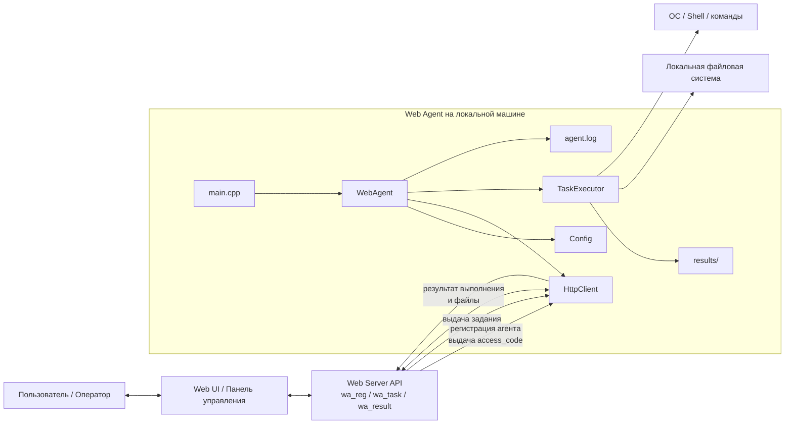

# Web Agent

Кроссплатформенный агент для выполнения распределённых заданий.

---

## 1. Назначение

Web Agent — это фоновый сервис, который:
- Периодически опрашивает сервер на наличие задач
- Выполняет полученные задания локально
- Отправляет результаты выполнения обратно на сервер

---

## 2. Возможности

| Функция | Описание |
|---------|----------|
| **Кроссплатформенность** | Поддержка Linux, Windows, macOS |
| **Регистрация** | Автоматическая регистрация на сервере с получением access_code |
| **Опрос сервера** | Периодический polling с настраиваемым интервалом |
| **Выполнение задач** | Поддержка 4 типов задач: FILE, TASK, CONF, TIMEOUT |
| **Логирование** | Двухуровневое логирование (консоль + файл) |
| **Обработка ошибок** | Retry механизм с экспоненциальной задержкой |
| **Гибкая конфигурация** | JSON конфиг с возможностью изменения "на лету" |

---

## 3. Быстрый старт

### Linux
```bash
sudo apt install cmake g++ libcurl4-openssl-dev libssl-dev git
mkdir build && cd build
cmake -DCMAKE_BUILD_TYPE=Release .. && make -j$(nproc)
./web-agent
```

### Windows (Visual Studio)
```powershell
mkdir build && cd build
cmake -G "Visual Studio 16 2019" -A x64 ..
cmake --build . --config Release
.\Release\web-agent.exe
```

### macOS
```bash
brew install cmake openssl curl git
cmake -DCMAKE_BUILD_TYPE=Release .. && make -j$(sysctl -n hw.ncpu)
./web-agent
```

**Подробные инструкции:** см. [Раздел 7](#7-сборка-и-запуск) и [docs/CROSS_PLATFORM.md](docs/CROSS_PLATFORM.md)

---

## 4. Архитектура

```
┌─────────────────┐     ┌──────────────────┐     ┌─────────────────┐
│   Веб-сайт      │     │   Web Server     │     │   Web Agent     │
│   (UI Panel)    │◄───►│   (API)          │◄───►│   (локально)    │
└─────────────────┘     └──────────────────┘     └─────────────────┘
```

### Компоненты агента:

```
┌─────────────────────────────────────────────────────────────┐
│                      WebAgent                                │
├─────────────┬─────────────┬──────────────┬──────────────────┤
│   Config    │  HttpClient │ TaskExecutor │     Logger       │
│  (настройки)│  (HTTP/CPR) │ (задачи)     │   (spdlog)       │
└─────────────┴─────────────┴──────────────┴──────────────────┘
```

---

## 5. Типы задач

| Код задачи | Описание | Формат options |
|------------|----------|----------------|
| **FILE** | Найти и отправить файл | `{"filename":"config.json"}` |
| **TASK** | Выполнить команду | `{"command":"uname -a"}` |
| **CONF** | Изменить параметр конфига | `{"key":"poll_interval_sec","value":"30"}` |
| **TIMEOUT** | Изменить интервал опроса | `{"interval":"15"}` |

---

## 6. API Сервера

### 6.1 Регистрация

```
POST /wa_reg/
Content-Type: application/json

{
    "UID": "agent-001",
    "descr": "web-agent"
}

Ответ:
{
    "code_responce": "0",
    "msg": "Регистрация прошла успешно",
    "access_code": "594807-1ddb-36af-9616-d8ed2b9d"
}
```

### 6.2 Получение задачи

```
POST /wa_task/
Content-Type: application/json

{
    "UID": "agent-001",
    "descr": "web-agent",
    "access_code": "594807-1ddb-36af-9616-d8ed2b9d"
}

Ответ (есть задача):
{
    "code_responce": "1",
    "task_code": "TASK",
    "options": "{\"command\":\"uname -a\"}",
    "session_id": "bvLeD2gv-gtKH-IhmW-rsfd-Ejn1kyweawwi",
    "status": "RUN"
}

Ответ (нет задачи):
{
    "code_responce": "0",
    "status": "WAIT"
}
```

### 6.3 Отправка результата

```
POST /wa_result/
Content-Type: multipart/form-data

Поля:
- result_code: 0 (успех) или < 0 (ошибка)
- result: JSON строка
  {
      "UID": "agent-001",
      "access_code": "...",
      "message": "задание выполнено",
      "files": 0,
      "session_id": "..."
  }
- file1, file2, ... (опционально)

Ответ:
{
    "code_responce": "0",
    "msg": "ok"
}
```

---

## 7. Конфигурация

### 7.1 Формат файла

```json
{
    "uid": "agent-001",
    "server_url": "https://xdev.arkcom.ru:9999/app/webagent1/api",
    "access_code": "",
    "tasks_folder": "./tasks",
    "results_folder": "./results",
    "log_file": "./agent.log",
    "poll_interval": 5,
    "max_poll_interval": 300,
    "timeout": 30,
    "max_retries": 3,
    "retry_delay": 5
}
```

### 7.2 Параметры

| Параметр | Тип | По умолчанию | Описание |
|----------|-----|--------------|----------|
| `uid` | string | - | Уникальный идентификатор агента |
| `server_url` | string | - | URL сервера |
| `access_code` | string | "" | Код доступа (получается при регистрации) |
| `tasks_folder` | path | "./tasks" | Папка для задач |
| `results_folder` | path | "./results" | Папка для результатов |
| `log_file` | path | "./agent.log" | Файл логов |
| `poll_interval` | int | 5 | Интервал опроса (сек) |
| `max_poll_interval` | int | 300 | Макс. интервал при ошибках (сек) |
| `timeout` | int | 30 | Таймаут HTTP запросов (сек) |
| `max_retries` | int | 3 | Макс. попыток при ошибке |
| `retry_delay` | int | 5 | Задержка между попытками (сек) |

---

## 8. Сборка и запуск

### 8.1 Требования

- CMake 3.14+
- C++17 компилятор (g++, clang++, MSVC)
- libcurl
- OpenSSL

### 8.2 Сборка на Linux

```bash
# Установка зависимостей (Ubuntu/Debian)
sudo apt install -y cmake g++ libcurl4-openssl-dev libssl-dev git

# Сборка
mkdir build && cd build
cmake -DCMAKE_BUILD_TYPE=Release ..
make -j$(nproc)

# Запуск
./web-agent
```

### 8.3 Сборка на Windows

**Visual Studio 2019/2022:**
```powershell
# В Developer Command Prompt
mkdir build && cd build
cmake -G "Visual Studio 16 2019" -A x64 ..
cmake --build . --config Release

# Запуск
.\Release\web-agent.exe
```

**MinGW-w64:**
```bash
mkdir build && cd build
cmake -G "MinGW Makefiles" -DCMAKE_BUILD_TYPE=Release ..
mingw32-make -j4
.\web-agent.exe
```

### 8.4 Сборка на macOS

```bash
# Установка зависимостей
brew install cmake openssl curl git

# Сборка
mkdir build && cd build
cmake -DCMAKE_BUILD_TYPE=Release \
      -DOPENSSL_ROOT_DIR=$(brew --prefix openssl) \
      ..
make -j$(sysctl -n hw.ncpu)

# Запуск
./web-agent
```

### 8.5 Параметры командной строки

```
./web-agent [-c файл_конфига]
  -c <файл>  Путь к файлу конфигурации
  -h         Показать справку
```

---

## 9. Логирование

### 9.1 Уровни

| Уровень | Консоль | Файл | Описание |
|---------|---------|------|----------|
| INFO | ✅ | ✅ | Важные события |
| WARNING | ✅ | ✅ | Предупреждения |
| ERROR | ✅ | ✅ | Ошибки |
| DEBUG | ❌ | ✅ | Отладочная информация |

### 8.2 Формат

```
[2026-03-31 17:45:14.388] [web-agent] [info] Сообщение
```

---

## 10. Обработка ошибок

### 10.1 Сетевые ошибки

- Автоматический retry с экспоненциальной задержкой
- Увеличение интервала опроса при повторных ошибках
- Повторная регистрация при истечении сессии

### 10.2 Ошибки выполнения задач

- Фиксация кода возврата
- Запись сообщения об ошибке
- Отправка статуса на сервер

---

## 11. Тестирование

### 11.1 Запуск тестов

```bash
cd build
./tests
```

### 11.2 Покрытие

| Модуль | Тесты |
|--------|-------|
| HttpClient | GET, POST, таймауты, ошибки |
| Config | Загрузка, валидация, значения по умолчанию |
| Task | Парсинг JSON, валидация |
| TaskExecutor | Команды, программы, файлы |
| Logger | Запись, форматирование |
| WebAgent | Регистрация, получение задач, отправка результатов |

---

## 12. Структура проекта

```
web_agent/
├── src/
│   ├── main.cpp                 # Точка входа
│   ├── agent/
│   │   ├── WebAgent.h/cpp       # Основной агент
│   ├── config/
│   │   ├── Config.h/cpp         # Конфигурация
│   ├── http/
│   │   ├── HttpClient.h/cpp     # HTTP клиент
│   ├── task/
│   │   ├── Task.h/cpp           # Структура задачи
│   │   └── TaskExecutor.h/cpp   # Выполнение задач
│   └── utils/
│       └── Logger.h/cpp         # Логирование
├── tests/
│   ├── test_main.cpp
│   ├── test_http.cpp
│   ├── test_parser.cpp
│   ├── test_task.cpp
│   ├── test_config.cpp
│   ├── test_logger.cpp
│   └── test_agent.cpp
├── config/
│   └── agent_config.json
├── docs/
│   ├── api_specification.md
│   ├── config_specification.md
│   └── modules/
├── CMakeLists.txt
└── README.md
```

---

## 13. Зависимости

| Библиотека | Версия | Назначение | Платформы |
|------------|--------|------------|-----------|
| **cpr** | 1.10.5 | HTTP клиент | Linux, Windows, macOS |
| **nlohmann/json** | 3.11.2 | JSON парсинг | Linux, Windows, macOS |
| **spdlog** | 1.12.0 | Логирование | Linux, Windows, macOS |
| **doctest** | 2.4.11 | Тестирование | Linux, Windows, macOS |
| **libcurl** | 7.68+ | Низкоуровневый HTTP | Linux, Windows, macOS |
| **OpenSSL** | 1.1.1+ | SSL/TLS | Linux, Windows, macOS |

---

## 14. Безопасность

- HTTPS соединение с сервером
- Проверка SSL сертификатов (опционально)
- Отсутствие хранения чувствительных данных
- Валидация входных данных

---

## 15. Производительность

| Метрика | Значение |
|---------|----------|
| Потребление памяти | ~10-20 MB |
| CPU в режиме ожидания | < 1% |
| Время запуска | < 1 сек |
| Интервал опроса | 2-300 сек (настраивается) |

---

## 16. Лицензия

Проект создан в учебных целях (МГТУ им. Баумана, курс 1, семестр 2).

---

## 17. Контекстная диаграмма

Ниже показан контекст работы системы на основе текущей реализации проекта: агент запускается локально, получает задания от серверного API, выполняет их в операционной системе и отправляет результаты обратно на сервер.



Что показывает диаграмма:
- пользователь работает через `Web UI`
- сервер через API регистрирует агент и выдаёт ему задания
- локальный `Web Agent` использует `Config`, `HttpClient` и `TaskExecutor`
- `TaskExecutor` выполняет команды в ОС и работает с локальными файлами
- результаты выполнения, статусы и файлы возвращаются обратно на сервер через `wa_result`
